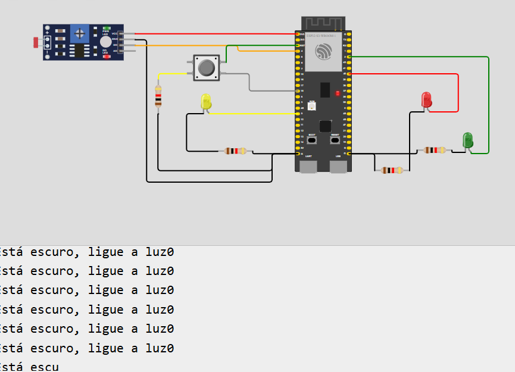

o estado noturno foi o único a ser testado pois o wokwi não compilava o código por sobrecarga na rede, sendo assim, não consegui testar os outros estados.

ademais, o wi-fi interno também não conectava, por isso comentei a linha de erro para possibilitar a testagem do resto do código
